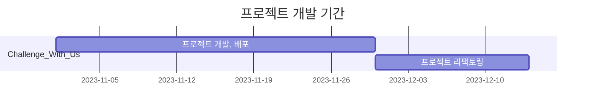

# challenge_with_us

[🔗 Challenge_With_Us 바로가기](https://bokgungom-market.vercel.app/)

## 💪 프로젝트 소개

- 💪 Challenge_With_Us 함께 챌린지에 도전하고 성취하기 위한 웹 서비스 입니다.
- 🏋️ 다양한 챌린지들을 만들고 인증할 수 있습니다.
- 🏞️ 챌린지를 직접 만들지 않고 다른 사람이 만든 챌린지에 참여하며 인증을 진행할 수도 있습니다.
- ✏️ 글과 사진을 함께 게시물에 작성하여 챌린지 인증을 공유할 수도 있습니다.
- ❤️ 다른 사용자의 챌린지나 피드에 좋아요하거나 댓글을 통해 소통할 수 있습니다.

<br>

## 💪 프로젝트 개발 기간


<br>

## 🫂 팀 소개 -> 로고로 변경할 예정


|<span style="font-size:16px">🤖 박지영 (팀장)</span>|<span style="font-size:16px">🔥 정혜성</span>|<span style="font-size:16px">🏅 김영훈</span>|<span style="font-size:16px">🦁 문근해</span>|
|:-:|:-:|:-:|:-:|
|<a href="https://github.com/gzero1016"></a>|<a href="https://github.com/comet7406"></a>|<a href="https://github.com/younghk37"></a>|<a href="https://github.com/hyejee0504"></a>|

- 코리아IT 부산 23-2기 프로젝트 1조 `강아지와 호랑이 세마리`입니다.
- 호랑이 띠 셋과 개띠 하나라는 조합이 개성있어 보여 다음과 같은 팀명을 짓게 되었습니다.

<p align="right"><a href="#top">TOP 🔼</a></p>
<br>


## 🙋‍♀️ 역할 분담
### [🔗 API 명세서 바로가기](https://www.notion.so/API-0ad3a65629fd4c3783d37cb6536dc906)

### 🤖 박지영

- 참여중인 ChallengeList 조회
- 참여한 Challenge 개수 조회
- 자기소개 CRUD
- 포인트 충전
- Challenge개설
- Challenge 삭제
- 나의 챌린지 참가 여부 조회
- Challenge 신청 대기조회
- Challenge 참가 신청
- Challenge 신청시 승인 및 거절
- Challenge 승인 알림 전송
- Challenge별 Feed 등록
- Challenge Feed 조회
- ChallengeDetails 조회
- Feed 인기순 정렬
- Feed 신고
- 관리자 페이지 Challenge 종료 및 삭제
- 관리자 페이지 총 챌린지수
- 총 회원수
- 총 피드수
- 총 종료된챌린지수
- 총 삭제된 챌린지수 통계
- 나의 종료된 ChallengeList 조회
- ChallengeFeed 조회
- Admin계정 정보 조회
- ChallengeFeed 개수조회
- 챌린지 개설자와 Feed 작성자 포인트 적립
- 가장인기있는 피드 조회

### 🔥 정혜성
- 게시글 상세보기 + 댓글 페이지
- 프로필 정보 수정
- 회원탈퇴
- ChallengeList 조회
- Challenge 조회
- Challenge 좋아요및 취소
- Challenger 조회 및 삭제
- ChallengeDetails 조회
- Feed 수정 및 삭제
- 출석체크

### 🏅 김영훈

- 시큐리티
- 로그인 및 회원가입
- ChallengeDetails Feed 좋아요 및 취소
- Feed 좋아요 및 취소
- 피드 최신 댓글 1개 조회
- 피드 댓글 CRUD
- 상점 물품 조회
- 상점 물품 구매 목록 조회
- 상점 물품 구매
- 알림 리스트 및 개수 조회
- 읽지않은 알림 개수 및 리스트 조회
- 알림 읽음 상태변경
- 가장 인기있는 챌린지 조회

### 🦁 문근해

- 공지 CRUD
- 알림기능
- ChallengeDetails
- 세부 기능 및 디자인

### 공통 작업
- 공통 컴포넌트

<br>

## ⚙️ 개발 환경
<div>
  
  
</div>
<div>
  
  
  
   
  
</div>
<div>
  
</div>
<div>
  
  
  
  
</div>

### ⛓️ pom.xml
|모듈명|용도|
|-|-|
|lombok| 어노테이션으로 코드 자동 생성을 위해 사용 |
|jjwt-api / jjwt-impl / jjwt-jackson| JWT 활용을 위해 사용 |
|spring-boot-starter-mail | 이메일 인증을 위해 사용 |
|spring-boot-starter-oauth2-client | oauth2 인증을 위해 사용 |
|spring-boot-starter-web | spring web 프로젝트에 필수적인 모듈 |
|mysql-connector-java | mysql 연결을 위해 사용 |
|spring-boot-starter-security | 스프링 시큐리티를 적용하기 위해 사용 |
|spring-boot-starter-aop | 스프링 aop를 적용하기 위해 사용 |
|mybatis-spring-boot-starter | mybatis를 적용하기 위해 사용 |
|spring-boot-starter-validation | 입력 값 검증을 위해 사용 |
|spring-boot-devtools | 빠른 재시작을 위해 사용 |


<p align="right"><a href="#top">TOP 🔼</a></p>
<br>

## <a href="https://github.com/nailedReact/bokgungom-market/wiki/%F0%9F%A4%9D-%ED%98%91%EC%97%85-&-%EB%B8%8C%EB%9E%9C%EC%B9%98-%EC%83%9D%EC%84%B1-%EA%B0%80%EC%9D%B4%EB%93%9C" target="_blank">🤝 협업 방식</a>

1. 프로젝트 노션 페이지 내 남은 작업 목록에서 원하는 작업을 분담합니다.
    
2. 해당하는 업무에 대해 **GitHub Issue**를 생성합니다. (이슈 템플릿 사용)
3. GitHub Actions에 의해 자동으로 생성된 브랜치로 전환하여 해당하는 업무를 진행합니다.
4. 작업을 완료하면 작업한 브랜치에서(main브랜치 X) 코드를 push합니다.
5. **PR(Pull Request)** 을 오픈합니다.
- PR(pull request)을 오픈하면, 푸시한 사람 외 다른 팀원 1명이 코드를 확인하고 승인합니다.
- PR이 오픈되면 다른 팀원들이 바로 확인할 수 있도록 디스코드 웹 훅 설정을 통해 팀 채팅방으로 알람을 받을 수 있도록 했습니다.
    

- 코드 리뷰 & 승인은 생산성을 위해 리뷰어를 1명으로 지정하되, 팀원들이 코드 스타일을 공유하며 서로 잘 이해할 수 있도록 순서를 정해 돌아가며 골고루 리뷰하도록 했습니다.

- 컨펌 담당
    - **지영** : `혜성`
    - **혜성** : `지영`
    - **영훈** : `근해`
    - **근해** : `영훈`

6. PR이 merge되어 close 되면 해당 이슈는 자동으로 Done상태로 변경됩니다.

<br>

## 📊 프로젝트 진행 상황 관리

- <a href="https://github.com/nailedReact/bokgungom-market/issues?q=is%3Aissue+is%3Aclosed" target="_blank">🔘 GitHub Issues</a>
    - 간편한 이슈 생성을 위해 이슈 템플릿을 만들어 사용했습니다.
    - 이슈 템플릿으로 어떤 이슈인지, 어떤 페이지에 해당하는 지, 구현 해야 하는 내용이 무엇인지를 적도록 했습니다.
    

    - 팀원이 현재 어떤 작업을 진행하고 있는지를 바로 알 수 있어 의사소통 비용을 줄일 수 있었습니다. 
- <a href="https://github.com/orgs/nailedReact/projects/1/views/1" target="_blank">🗂️ GitHub Projects</a>
    - 칸반 보드로 프로젝트 진행 상황을 한 눈에 확인할 수 있어 일정을 관리하기 수월했습니다.
    

<p align="right"><a href="#top">TOP 🔼</a></p>
<br>

## 🔀 브랜치 전략

### 👍 GitHub Flow 전략

- 개발과 동시에 지속적으로 배포를 진행할 것이 아니라, 기능을 모두 개발하고 최종적으로 배포를 할 예정이었기 때문에 Git flow에 비해 흐름이 단순해짐에 따라 그 규칙도 단순한 GitHub Flow 전략이 적합하다고 생각했습니다.
- 프로젝트 기간 동안 팀원들이 같은 시간에 작업하기 때문에 잦은 충돌이 발생할 것을 우려하여 충돌의 크기를 줄이고자 GitHub Flow 전략을 채택하여 작은 단위로 이슈를 쪼개 이슈 별로 브랜치를 분기하고 main 브랜치에 지속적으로 merge 하는 방식으로 진행했습니다.
- 기본적으로 master branch에 대한 규칙만 정확하게 정립되어 있다면 나머지 가지들에 대해서는 특별한 관여를 하지 않으며 pull request기능을 사용하도록 권장하였습니다.

<br>

### 🚀 GitHub Action - 브랜치 생성 자동화

- 이슈를 생성하면 GitHub Action으로 해당 이슈에 해당하는 브랜치가 자동으로 생성되도록 설정하여 브랜치명을 고민하고 브랜치를 생성하는 시간을 줄였습니다.
- 예) 자동 생성된 브랜치를 pull 하고 ```git fetch ```한뒤 ```git checkout -t origin/feat/issue-81```하여 해당 브랜치로 이동합니다.
- [브랜치 history](https://github.com/KoreaIt-J-23-2-1/challenge_with_us_frontend/blob/main/%ED%94%84%EB%A1%A0%ED%8A%B8%20%EB%B8%8C%EB%9E%9C%EC%B9%98%ED%9E%88%EC%8A%A4%ED%86%A0%EB%A6%AC.png)

<p align="right"><a href="#top">TOP 🔼</a></p>
<br>

## 📐 컨벤션

팀원 간의 원활한 소통과 협업을 위해 커밋 컨벤션과, 코드 컨벤션을 만들어 이를 따랐습니다.
리드미에는 간략히 작성하고, 자세한 컨벤션은 각각의 타이틀에 링크된 깃허브 위키에 적어두었습니다.


### [🔗 커밋 컨벤션](https://www.notion.so/Git-Commit-Message-Convention-569511dc005141dd80a03a43bdb1fc7d)

- 깃 커밋 컨벤션을 참고하여 회의를 통해 프로젝트에서 사용할 컨벤션을 지정했습니다.

    ```
    1. 커밋 유형 지정
        - 커밋 유형은 영어 대문자로 작성하기
        - 커밋 유형
        - Feat : 새로운 기능 추가
        - Fix : 버그 수정
        - Docs : 문서 수정
        - Style : 코드 formatting, 세미콜론 누락, 코드 자체의 변경이 없는 경우
        - Refactor : 코드 리팩토링
        - Test : 테스트 코드, 리팩토링 테스트 코드 추가
        - Chore : 패키지 매니저 수정, 그 외 기타 수정 ex) .gitignore
        - Design : CSS 등 사용자 UI 디자인 변경
        - Comment : 필요한 주석 추가 및 변경
        - Rename : 파일 또는 폴더 명을 수정하거나 옮기는 작업만인 경우
        - Remove : 파일을 삭제하는 작업만 수행한 경우
        - !BREAKING CHANGE : 커다란 API 변경의 경우
        - !HOTFIX : 급하게 치명적인 버그를 고쳐야 하는 경우

    🧾 2. 제목과 본문을 빈행으로 분리
            - 커밋 유형 이후 제목과 본문은 한글로 작성하여 내용이 잘 전달될 수 있도록 할 것
            - 본문에는 변경한 내용과 이유 설명 (어떻게보다는 무엇 & 왜를 설명)

    #️⃣ 3. 제목 첫 글자는 대문자로, 끝에는 . 금지 

    ↩️ 4. 제목은 영문 기준 50자 이내로 할 것

    ⏺️ 5. 자신의 코드가 직관적으로 바로 파악할 수 있다고 생각하지 말자

    👆 6. 여러가지 항목이 있다면 글머리 기호를 통해 가독성 높이기
    ```

<br>

### [🔗 코드 컨벤션](https://www.notion.so/Code-Convention-8ee36b86139d40a6b13cfb2693567fa1)
- 자바 코딩 컨벤션을 참고하여 회의를 진행해 저희 조만의 코드 컨벤션을 결정 했습니다.
- 코드 작성의 편의성을 고려하여 혼동이 없을 것 같다고 생각되는 컨벤션은 포함 시키지 않도록 했습니다.

    ```
    🛼 문자열을 처리할 때는 쌍따옴표를 사용하도록 합니다. 

    🐫 문장이 종료될 때는 세미콜론을 붙여줍니다. 

    💄 함수명, 변수명은 카멜케이스로 작성합니다. 

    🐫 가독성을 위해 한 줄에 하나의 문장만 작성합니다. 

    ❓ 주석은 설명하려는 구문에 맞춰 들여쓰기 합니다.

    🔠 연산자 사이에는 공백을 추가하여 가독성을 높입니다. 

    🔢 콤마 다음에 값이 올 경우 공백을 추가하여 가독성을 높입니다.

    💬 생성자 함수명의 맨 앞글자는 대문자로 합니다. 

    🔚 var는 절대 사용하지 않는다. (const를 let 보다 위에 선언한다)

    👆 const와 let은 사용 시점에 선언 및 할당을 한다. (함수는 변수 선언문 다음에 오도록한다.)

    ✏️ 외부 모듈과 내부 모듈을 구분하여 사용한다.

    🧮 배열과 객체는 반드시 리터럴로 선언한다. (new 사용 X)

    📠 배열 복사 시 반복문을 사용하지 않는다.
    
    😎 배열의 시작 괄호 안에 요소가 줄 바꿈으로 시작되었다면 끝 괄호 이전에도 일관된 줄 바꿈 해야한다. (일관되게 모두 줄 바꿈을 해주어야 한다.)
    
    🧶 객체의 프로퍼티가 1개인 경우에만 한 줄 정의를 허용하며, 2개 이상일 경우에는 개행을 강제한다. (객체 리터럴 정의 시 콜론 앞은 공백을 허용하지 않음 콜론 뒤는 항상 공백을 강제)
    
    🧂 메서드 문법 사용 시 메서드 사이에 개행을 추가한다.

    🌭 화살표 함수의 파라미터가 하나이면 괄호를 생략한다.

    🍳 변수 등을 조합해서 문자열을 생성하는 경우 템플릿 문자열을 이용한다.

    🧇 변수 등을 조합해서 문자열을 생성하는 경우 템플릿 문자열을 이용한다.

    🥞 wildcard import는 사용하지 않는다. (import문으로부터 직접 export하지 않는다.)

    🥖 한 줄짜리 블록일 경우라도 {}를 생략하지 않으며 명확히 줄 바꿈 하여 사용한다.

    🥯 switch-case 사용 시 첫 번째 case문을 제외하고 case문 사용 이전에 개행한다.

    🥐 삼중 등호 연산자인 ===, !==만 사용한다.

    🚐 반복문 사용은 일반화된 순회 메서드 사용을 권장한다.

    🚑 람다함수 안에서 밖에 있는 변수를 사용하지 말라

    🚚 코드 블럭 주석 처리를 위해서는 한 줄 주석을 사용한다. 여러 줄 주석을 작성할 때는 *의 들여쓰기를 맞춘다. 주석의 첫 줄과 마지막 줄은 비워둠

    💫 시작 괄호 바로 다음과 끝 괄호 바로 이전에 공백이 있으면 안 된다.
    ```

<p align="right"><a href="#top">TOP 🔼</a></p>
<br>

## 페이지 미리보기

<table width="100%">
<tr>
    <th colspan="2">메인 페이지</th>
</tr>

<tr align="center">
    <td valign="top" width="50%">
    메인(출석체크 🖥️)
    </td>
    <td valign="top" width="50%">
    메인(출석체크 📱)
    </td>
</tr>

<tr>
    <td valign="top" width="50%">
        
    </td>
    <td valign="top" width="50%">
        
    </td>
</tr>
    
<tr>
    <th colspan="2">스플래시 페이지</th>
</tr>

<tr align="center">
    <td valign="top" width="66%">
    스플래시(데스크탑 🖥️)
    </td>
    <td valign="top" width="33%">
    스플래시(모바일 📱)
    </td>
</tr>

<tr>
    <td valign="top" width="75%">
    
    </td>
    <td valign="top" width="25%">
    <a href="https://github.com/nailedReact/react-app/wiki/%EB%B3%B5%EA%B7%BC%EA%B3%B0%EB%A7%88%EC%BC%93-%ED%8E%98%EC%9D%B4%EC%A7%80-%EC%84%A4%EB%AA%85#%EC%8A%A4%ED%94%8C%EB%9E%98%EC%8B%9C-%ED%8E%98%EC%9D%B4%EC%A7%80"></a>
    </td>
</tr>

<tr>
    <th colspan="2">회원가입 페이지</th>
</tr>

<tr align="center">
    <td valign="top" width="66%">
    회원가입(데스크탑 🖥️)
    </td>
    <td valign="top" width="33%">
    회원가입(모바일 📱)
    </td>
</tr>

<tr>
    <td valign="top" width="75%">
    <a href="https://github.com/nailedReact/react-app/wiki/%EB%B3%B5%EA%B7%BC%EA%B3%B0%EB%A7%88%EC%BC%93-%ED%8E%98%EC%9D%B4%EC%A7%80-%EC%84%A4%EB%AA%85#%ED%9A%8C%EC%9B%90%EA%B0%80%EC%9E%85"></a>
    </td>
    <td valign="top" width="25%">
    <a href="https://github.com/nailedReact/react-app/wiki/%EB%B3%B5%EA%B7%BC%EA%B3%B0%EB%A7%88%EC%BC%93-%ED%8E%98%EC%9D%B4%EC%A7%80-%EC%84%A4%EB%AA%85#%ED%9A%8C%EC%9B%90%EA%B0%80%EC%9E%85"></a>
    </td>
</tr>

<tr>
    <th colspan="2">로그인 페이지</th>
</tr>

<tr align="center">
    <td valign="top" width="66%">
    로그인(데스크탑 🖥️)
    </td>
    <td valign="top" width="33%">
    로그인(모바일 📱)
    </td>
</tr>

<tr>
    <td valign="top" width="75%">
    <a href="https://github.com/nailedReact/react-app/wiki/%EB%B3%B5%EA%B7%BC%EA%B3%B0%EB%A7%88%EC%BC%93-%ED%8E%98%EC%9D%B4%EC%A7%80-%EC%84%A4%EB%AA%85#%EB%A1%9C%EA%B7%B8%EC%9D%B8"></a>
    </td>
    <td valign="top" width="25%">
    <a href="https://github.com/nailedReact/react-app/wiki/%EB%B3%B5%EA%B7%BC%EA%B3%B0%EB%A7%88%EC%BC%93-%ED%8E%98%EC%9D%B4%EC%A7%80-%EC%84%A4%EB%AA%85#%EB%A1%9C%EA%B7%B8%EC%9D%B8"></a>
    </td>
</tr>

<tr>
    <th colspan="2">홈 피드 페이지</th>
</tr>

<tr align="center">
    <td valign="top" width="66%">
    홈 피드(데스크탑 🖥️)
    </td>
    <td valign="top" width="33%">
    홈 피드(모바일 📱)
    </td>
</tr>

<tr>
    <td valign="top" width="75%">
    <a href="https://github.com/nailedReact/react-app/wiki/%EB%B3%B5%EA%B7%BC%EA%B3%B0%EB%A7%88%EC%BC%93-%ED%8E%98%EC%9D%B4%EC%A7%80-%EC%84%A4%EB%AA%85#%ED%99%88-%ED%94%BC%EB%93%9C"></a>
    </td>
    <td valign="top" width="25%">
    <a href="https://github.com/nailedReact/react-app/wiki/%EB%B3%B5%EA%B7%BC%EA%B3%B0%EB%A7%88%EC%BC%93-%ED%8E%98%EC%9D%B4%EC%A7%80-%EC%84%A4%EB%AA%85#%ED%99%88-%ED%94%BC%EB%93%9C"></a>
    </td>
</tr>


<tr>
    <th colspan="2">게시글 상세 보기 + 댓글 페이지 </th>
</tr>

<tr align="center">
    <td valign="top" width="66%">
    게시글 상세 보기 + 댓글(데스크탑 🖥️)
    </td>
    <td valign="top" width="33%">
    게시글 상세 보기 + 댓글(모바일 📱)
    </td>
</tr>

<tr>
    <td valign="top" width="75%">
    <a href="https://github.com/nailedReact/react-app/wiki/%EB%B3%B5%EA%B7%BC%EA%B3%B0%EB%A7%88%EC%BC%93-%ED%8E%98%EC%9D%B4%EC%A7%80-%EC%84%A4%EB%AA%85#%EA%B2%8C%EC%8B%9C%EA%B8%80-%EC%83%81%EC%84%B8-%EB%B3%B4%EA%B8%B0--%EB%8C%93%EA%B8%80"></a>
    </td>
    <td valign="top" width="25%">
    <a href="https://github.com/nailedReact/react-app/wiki/%EB%B3%B5%EA%B7%BC%EA%B3%B0%EB%A7%88%EC%BC%93-%ED%8E%98%EC%9D%B4%EC%A7%80-%EC%84%A4%EB%AA%85#%EA%B2%8C%EC%8B%9C%EA%B8%80-%EC%83%81%EC%84%B8-%EB%B3%B4%EA%B8%B0--%EB%8C%93%EA%B8%80"></a>
    </td>
</tr>

<tr>
    <th colspan="2">게시글 업로드 페이지</th>
</tr>

<tr align="center">
    <td valign="top" width="66%">
    게시글 업로드(데스크탑 🖥️)
    </td>
    <td valign="top" width="33%">
    게시글 업로드(모바일 📱)
    </td>
</tr>

<tr>
    <td valign="top" width="75%">
    <a href="https://github.com/nailedReact/react-app/wiki/%EB%B3%B5%EA%B7%BC%EA%B3%B0%EB%A7%88%EC%BC%93-%ED%8E%98%EC%9D%B4%EC%A7%80-%EC%84%A4%EB%AA%85#%EA%B2%8C%EC%8B%9C%EA%B8%80-%EC%97%85%EB%A1%9C%EB%93%9C"></a>
    </td>
    <td valign="top" width="25%">
    <a href="https://github.com/nailedReact/react-app/wiki/%EB%B3%B5%EA%B7%BC%EA%B3%B0%EB%A7%88%EC%BC%93-%ED%8E%98%EC%9D%B4%EC%A7%80-%EC%84%A4%EB%AA%85#%EA%B2%8C%EC%8B%9C%EA%B8%80-%EC%97%85%EB%A1%9C%EB%93%9C"></a>
    </td>
</tr>

<tr>
    <th colspan="2">상품 업로드 페이지</th>
</tr>

<tr align="center">
    <td valign="top" width="66%">
    상품 업로드(데스크탑 🖥️)
    </td>
    <td valign="top" width="33%">
    상품 업로드(모바일 📱)
    </td>
</tr>

<tr>
    <td valign="top" width="75%">
    <a href="https://github.com/nailedReact/react-app/wiki/%EB%B3%B5%EA%B7%BC%EA%B3%B0%EB%A7%88%EC%BC%93-%ED%8E%98%EC%9D%B4%EC%A7%80-%EC%84%A4%EB%AA%85#%EC%83%81%ED%92%88-%EC%97%85%EB%A1%9C%EB%93%9C"></a>
    </td>
    <td valign="top" width="25%">
    <a href="https://github.com/nailedReact/react-app/wiki/%EB%B3%B5%EA%B7%BC%EA%B3%B0%EB%A7%88%EC%BC%93-%ED%8E%98%EC%9D%B4%EC%A7%80-%EC%84%A4%EB%AA%85#%EC%83%81%ED%92%88-%EC%97%85%EB%A1%9C%EB%93%9C"></a>
    </td>
</tr>

<tr>
    <th colspan="2">검색 페이지</th>
</tr>

<tr align="center">
    <td valign="top" width="66%">
    검색(데스크탑 🖥️)
    </td>
    <td valign="top" width="33%">
    검색(모바일 📱)
    </td>
</tr>

<tr>
    <td valign="top" width="75%">
    <a href="https://github.com/nailedReact/react-app/wiki/%EB%B3%B5%EA%B7%BC%EA%B3%B0%EB%A7%88%EC%BC%93-%ED%8E%98%EC%9D%B4%EC%A7%80-%EC%84%A4%EB%AA%85#%EA%B2%80%EC%83%89"></a>
    </td>
    <td valign="top" width="25%">
    <a href="https://github.com/nailedReact/react-app/wiki/%EB%B3%B5%EA%B7%BC%EA%B3%B0%EB%A7%88%EC%BC%93-%ED%8E%98%EC%9D%B4%EC%A7%80-%EC%84%A4%EB%AA%85#%EA%B2%80%EC%83%89"></a>
    </td>
</tr>


<tr>
    <th colspan="2">프로필 페이지</th>
</tr>

<tr align="center">
    <td valign="top" width="66%">
    프로필(데스크탑 🖥️)
    </td>
    <td valign="top" width="33%">
    프로필(모바일 📱)
    </td>
</tr>

<tr>
    <td valign="top" width="75%">
    <a href="https://github.com/nailedReact/react-app/wiki/%EB%B3%B5%EA%B7%BC%EA%B3%B0%EB%A7%88%EC%BC%93-%ED%8E%98%EC%9D%B4%EC%A7%80-%EC%84%A4%EB%AA%85#%ED%94%84%EB%A1%9C%ED%95%84"></a>
    </td>
    <td valign="top" width="25%">
    <a href="https://github.com/nailedReact/react-app/wiki/%EB%B3%B5%EA%B7%BC%EA%B3%B0%EB%A7%88%EC%BC%93-%ED%8E%98%EC%9D%B4%EC%A7%80-%EC%84%A4%EB%AA%85#%ED%94%84%EB%A1%9C%ED%95%84"></a>
    </td>
</tr>

<tr>
    <th colspan="2">프로필 수정 페이지</th>
</tr>

<tr align="center">
    <td valign="top" width="66%">
    프로필 수정(데스크탑 🖥️)
    </td>
    <td valign="top" width="33%">
    프로필 수정(모바일 📱)
    </td>
</tr>

<tr>
    <td valign="top" width="75%">
    <a href="https://github.com/nailedReact/react-app/wiki/%EB%B3%B5%EA%B7%BC%EA%B3%B0%EB%A7%88%EC%BC%93-%ED%8E%98%EC%9D%B4%EC%A7%80-%EC%84%A4%EB%AA%85#%ED%94%84%EB%A1%9C%ED%95%84-%EC%88%98%EC%A0%95"></a>
    </td>
    <td valign="top" width="25%">
    <a href="https://github.com/nailedReact/react-app/wiki/%EB%B3%B5%EA%B7%BC%EA%B3%B0%EB%A7%88%EC%BC%93-%ED%8E%98%EC%9D%B4%EC%A7%80-%EC%84%A4%EB%AA%85#%ED%94%84%EB%A1%9C%ED%95%84-%EC%88%98%EC%A0%95"></a>
    </td>
</tr>

<tr>
    <th colspan="2">로그아웃 페이지</th>
</tr>

<tr align="center">
    <td valign="top" width="66%">
    로그아웃(데스크탑 🖥️)
    </td>
    <td valign="top" width="33%">
    로그아웃(모바일 📱)
    </td>
</tr>

<tr>
    <td valign="top" width="75%">
    <a href="https://github.com/nailedReact/react-app/wiki/%EB%B3%B5%EA%B7%BC%EA%B3%B0%EB%A7%88%EC%BC%93-%ED%8E%98%EC%9D%B4%EC%A7%80-%EC%84%A4%EB%AA%85#%EB%A1%9C%EA%B7%B8%EC%95%84%EC%9B%83"></a>
    </td>
    <td valign="top" width="25%">
    <a href="https://github.com/nailedReact/react-app/wiki/%EB%B3%B5%EA%B7%BC%EA%B3%B0%EB%A7%88%EC%BC%93-%ED%8E%98%EC%9D%B4%EC%A7%80-%EC%84%A4%EB%AA%85#%EB%A1%9C%EA%B7%B8%EC%95%84%EC%9B%83"></a>
    </td>
</tr>

<tr>
    <th colspan="2">채팅 페이지</th>
</tr>

<tr align="center">
    <td valign="top" width="66%">
    채팅(데스크탑 🖥️)
    </td>
    <td valign="top" width="33%">
    채팅(모바일 📱)
    </td>
</tr>

<tr>
    <td valign="top" width="75%">
    <a href="https://github.com/nailedReact/react-app/wiki/%EB%B3%B5%EA%B7%BC%EA%B3%B0%EB%A7%88%EC%BC%93-%ED%8E%98%EC%9D%B4%EC%A7%80-%EC%84%A4%EB%AA%85#%EC%B1%84%ED%8C%85"></a>
    </td>
    <td valign="top" width="25%">
    <a href="https://github.com/nailedReact/react-app/wiki/%EB%B3%B5%EA%B7%BC%EA%B3%B0%EB%A7%88%EC%BC%93-%ED%8E%98%EC%9D%B4%EC%A7%80-%EC%84%A4%EB%AA%85#%EC%B1%84%ED%8C%85"></a>
    </td>
</tr>

<tr>
    <th colspan="2">404 페이지</th>
</tr>

<tr align="center">
    <td valign="top" width="66%">
    404(데스크탑 🖥️)
    </td>
    <td valign="top" width="33%">
    404(모바일 📱)
    </td>
</tr>

<tr>
    <td valign="top" width="75%">
    <a href="https://github.com/nailedReact/react-app/wiki/%EB%B3%B5%EA%B7%BC%EA%B3%B0%EB%A7%88%EC%BC%93-%ED%8E%98%EC%9D%B4%EC%A7%80-%EC%84%A4%EB%AA%85#404"></a>
    </td>
    <td valign="top" width="25%">
    <a href="https://github.com/nailedReact/react-app/wiki/%EB%B3%B5%EA%B7%BC%EA%B3%B0%EB%A7%88%EC%BC%93-%ED%8E%98%EC%9D%B4%EC%A7%80-%EC%84%A4%EB%AA%85#404"></a>
    </td>
</tr>

</table>

<br>

## 로컬 환경에서 프로젝트 구동 - 백엔드

- 레포지토리 클론
```
git clone https://github.com/KoreaIt-J-23-2-1/challenge_with_us_backend
```
- 프로젝트 소스 코드 폴더로 이동
```
cd my-app
```
- maven 빌드 진행
```
./mvnw clean package -Dtestskip
```
- 백그라운드에서 실행
```
nohup java -jar ~.jar &
```

## 로컬 환경에서 프로젝트 구동 - 프론트

- 레포지토리 클론
```
git clone https://github.com/KoreaIt-J-23-2-1/challenge_with_us_frontend
```
- 프로젝트 소스 코드 폴더로 이동
```
cd my-app
```
- 필요한 모듈 설치
```
npm install
```
- 로컬 환경에서 리액트 앱을 실행
```
npm start
```

<p align="right"><a href="#top">TOP 🔼</a></p>
